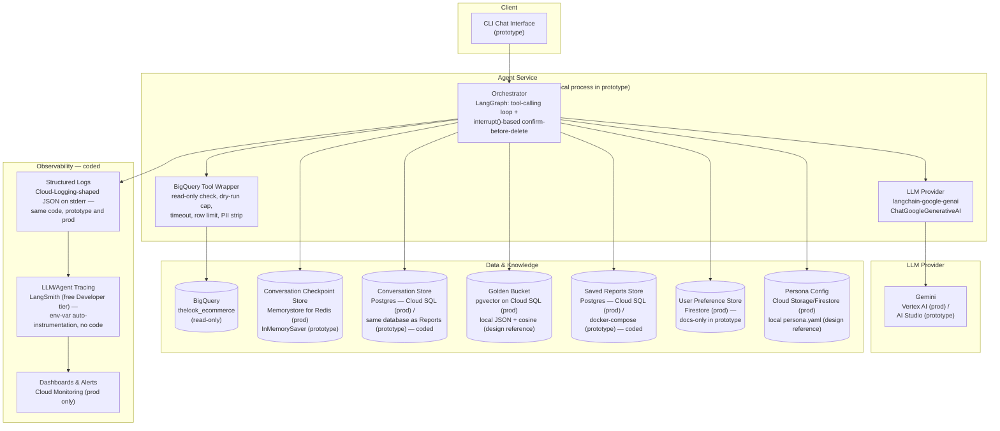

# Retail Data Analysis Agent

A production-grade High-Level Design plus a working prototype for an
internal chat agent that lets non-technical Store/Regional Managers ask
natural-language questions over `bigquery-public-data.thelook_ecommerce`,
discuss the results conversationally, and turn them into saved reports with
action items. Originally scoped as a take-home technical assignment; built
the way a real production agent would be — with typed error handling,
human-in-the-loop oversight on destructive actions, structured tracing, and
a regression-gate eval harness, not just a happy-path demo.

## What this demonstrates

- **Design → build, not just build.** A full production HLD
  ([docs/design.md](docs/design.md)) covering all 8 requirements in the
  brief, with the prototype implementing the 5 that are actually
  code-gradeable — every coded piece traces back to a documented design
  decision.
- **Safety & PII masking** — an input-side guardrail against prompt
  injection, an instruction to treat all tool output as untrusted data, and
  schema-verified PII column stripping in the BigQuery wrapper: the
  registry is checked against the *live* `users` schema rather than just
  the brief's PII list, and covers two additional columns (`postal_code`,
  `user_geom`) a brief-only list would miss.
- **Resilience** — typed, self-correcting error handling: syntax errors get
  fed back to the model to retry with a different query (bounded, never
  unbounded), permission/transient errors go straight to a graceful
  message, and a separate backoff layer handles transient BigQuery/Gemini
  failures beneath the graph entirely.
- **High-stakes oversight** — a Postgres-backed Saved Reports Store with a
  LangGraph `interrupt()`-based confirm-then-delete flow: destructive
  requests ("delete all reports mentioning Client X") pause, show the
  exact candidates, and require an explicit yes before anything is removed.
- **Observability** — structured JSON tracing plus LangSmith
  auto-instrumentation, so every LLM call, tool call, and turn is
  reconstructable end to end. See [Observability](#observability) below.
- **Quality Assurance** — a golden-set eval harness with deterministic
  checks and an LLM-as-judge rubric, run as a manual regression gate. See
  [Quality Assurance](#quality-assurance) below.

## Architecture



*The production architecture — everything with "coded" in its label is
running in this prototype today; the rest (Golden Bucket, Persona Config,
Preference Store) is designed in full in
[docs/design.md](docs/design.md) but out of scope for a prototype grade.*

There's a second diagram worth knowing about:
[docs/design.md §2a](docs/design.md#2a-current-graph-structure-generated-not-hand-drawn)
is generated directly from the compiled LangGraph `StateGraph`
(`graph.get_graph().draw_mermaid()`, regenerated with
`uv run python scripts/render_graph.py`), not hand-drawn — it shows exactly
what's running today and can't silently drift from the code the way a
hand-maintained diagram can.

## Coded vs. designed

| # | Requirement | Status |
|---|---|---|
| 1 | Hybrid Intelligence (Golden Bucket) | Designed only |
| 2 | Safety & PII Masking | **Coded** |
| 3 | High-Stakes Oversight | **Coded** |
| 4 | Continuous Improvement | Designed only |
| 5 | Resilience & Error Handling | **Coded** |
| 6 | Quality Assurance | **Coded** |
| 7 | Observability | **Coded** |
| 8 | Agility (Persona Management) | Designed only |

5 of 8 requirements are coded — all 5 that were ever prototype-eligible per
the assignment brief (2 of 5 is the stated minimum). The other 3 were never
gradeable-in-code candidates to begin with; they're still designed in full.
Full reasoning and trade-offs for every row:
[docs/design.md §9](docs/design.md#9-prototype-vs-production-scope-matrix).

## Quick start

Three things need configuring with different prerequisites: Gemini is a
single API key; BigQuery needs the `gcloud` CLI and a real GCP project (even
though the queried dataset is public); the Saved Reports Store needs a
running Postgres, provided locally via `docker-compose.yml`. Full detail,
including troubleshooting, is in [design.md §8](docs/design.md#8-setup-instructions--example-run).

```bash
# Prerequisites: Python 3.11, uv, gcloud CLI, a GCP project with the
# BigQuery API enabled and billing active, a Gemini API key from
# https://aistudio.google.com/apikey, Docker (for the Saved Reports Store's
# local Postgres)

gcloud auth application-default login
cp .env.example .env   # fill in GOOGLE_CLOUD_PROJECT and GEMINI_API_KEY

docker compose up -d postgres
uv sync
uv run retail-agent
```

## Observability

Every LLM call, tool call, and turn emits one structured JSON line
(`tracing.py`), in the shape Cloud Logging auto-parses from stdout/stderr —
the same code path runs in the prototype and would in production:

```json
{"severity": "INFO", "message": "tool_call", "conversation_id": "cli-session-lori28", "turn_id": "…", "tool": "run_query", "sql": "SELECT …", "rows_returned": 7, "latency_ms": 412.3, "error_class": null, "self_correct_attempt": 0}
```

Every line carries `conversation_id`, so a full exchange — including any
self-correct retries — can be reconstructed by filtering on that field:

```bash
uv run retail-agent 2>trace.jsonl
# use the CLI normally in this terminal; tail -f trace.jsonl elsewhere
```

For a conversation-level view without grepping JSON, set
`LANGSMITH_TRACING=true` + `LANGSMITH_API_KEY` (free Developer tier, no
credit card — see `.env.example`) and every run auto-instruments through
LangSmith with zero code changes. Full reasoning, including why LangSmith
was chosen over a self-hosted tracer for this prototype (and when that
choice should flip):
[docs/design.md §3](docs/design.md#3-component-reasoning),
[docs/implementation-notes.md](docs/implementation-notes.md#observability-langsmith-instead-of-self-hosted-langfuse).

## Quality Assurance

A golden-set eval harness (`eval/golden_set.json`) runs 9 hand-curated
questions — one per capability the assignment brief names — through the
real compiled graph and scores each answer two ways: cheap deterministic
checks first (was the expected tool called, did the SQL touch an expected
table, does the answer mention an expected keyword, no PII-shaped text),
then an LLM-as-judge pass scoring whether the answer addresses the question
asked, whether its claims are internally plausible, and whether it leaks
PII.

```bash
uv run python scripts/run_eval.py [--golden-set eval/golden_set.json] [--out eval_results.json] [--fail-under 0.8]
```

This makes real, billed Gemini + BigQuery calls, so — like
`tests/integration/` — it's a deliberate manual action, never run by
`uv run pytest`. `--fail-under` exits non-zero below a pass-rate threshold,
for wiring into CI later without further code changes. Full reasoning and
accepted gaps (sample size, no ground-truth SQL diffing, single-run
variance):
[docs/design.md §7](docs/design.md#7-quality-assurance--evaluation),
[docs/implementation-notes.md](docs/implementation-notes.md#quality-assurance-golden-set-eval-harness-implementation-notes).

## MCP server

The same data and reports tools are also available to any MCP client —
Claude Code, Claude Desktop, MCP Inspector — through a stdio MCP server:

```bash
uv run retail-mcp                                         # what a client launches
npx @modelcontextprotocol/inspector uv run retail-mcp     # try the tools in a browser
```

Opening this repo in Claude Code picks it up from `.mcp.json`. It needs
BigQuery and Postgres as above, but no Gemini key — the client's model
does the reasoning. Every guarantee is enforced under the tool, not left
to the client: PII columns are stripped server-side, reports are
owner-scoped, and deletion is two calls — `preview_delete` returns the
exact candidates plus a short-lived token, and `confirm_delete(token)`
deletes exactly those, once. Design and trade-offs:
[docs/design.md §3](docs/design.md#3-component-reasoning),
[docs/implementation-notes.md](docs/implementation-notes.md#mcp-server-implementation-notes).

## Testing

```bash
uv run pytest
```

Needs a local Postgres (`docker compose up -d postgres`) for
`test_reports_store.py`/`test_conversation_store.py`. `tests/integration/`
(live BigQuery/Gemini regression checks) and the eval harness above are
both opt-in only — they require real *exported* `GOOGLE_CLOUD_PROJECT`/
`GEMINI_API_KEY` environment variables, not just a configured `.env`, so
`uv run pytest` never makes a live, billed call by accident. See
[design.md §8](docs/design.md#8-setup-instructions--example-run) for how to
run them explicitly.

## Docs

- [docs/design.md](docs/design.md) — High-Level Design: architecture,
  component reasoning, data flow, error handling, requirement-by-requirement
  coverage, and full setup instructions (source of truth — start here)
- [docs/implementation-notes.md](docs/implementation-notes.md) —
  implementation-level detail, rejected alternatives, and gaps found during
  testing
- [CLAUDE.md](CLAUDE.md) — build constraints and current prototype scope
