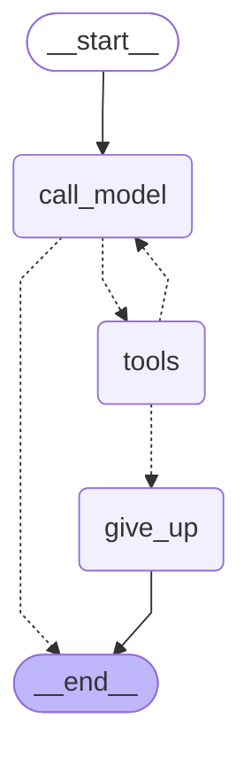

# Retail Data Analysis Agent — High-Level Design

Source of truth for architecture and design decisions. Update this file
whenever a decision changes; see `src/provided/CLAUDE.md` for build
constraints and current prototype scope, `docs/assignment.md` for the brief.

## 1. Overview

An internal chat agent for non-technical Store/Regional Managers to ask
natural-language questions over `bigquery-public-data.thelook_ecommerce`,
discuss results conversationally, and save reports with action items. The
design below is a production HLD; the prototype implements a subset (see
§9) chosen to demonstrate the requirements that are actually gradeable as
working code, while every requirement is designed in full here regardless
of whether it's coded.

## 2. Architecture Diagram


## 2a. Current Graph Structure (generated, not hand-drawn)

The diagram above is the production system architecture — most of it
(Golden Bucket, Reports store, Persona config) isn't coded yet. This one is
different in kind: it's Mermaid syntax read directly off the real compiled
`StateGraph` in `graph.py` via `graph.get_graph().draw_mermaid()`, so it
shows exactly what's running today, not an aspiration. Regenerate it with
`uv run python scripts/render_graph.py` any time the graph changes — step 3
(the delete-confirmation `interrupt()`) will add nodes here.



- **`call_model`** — sends the running message history plus the tool
  schemas to the current LLM provider (Gemini, or OpenRouter if the circuit
  breaker has failed over) and appends whatever comes back (text, a tool
  call, or both).
- **`tools`** — executes every tool call in the latest model message
  against `BigQueryTool`, appends the results as `FunctionResponse`s, and
  tracks per-turn `self_correct_attempts`/`empty_result_sanity_checked`/
  `last_tool_errors` state (the resilience-depth mechanisms in §5).
- **`give_up`** — terminal node reached when a tool error isn't
  self-correctable or the self-correct budget (2 retries) is exhausted;
  emits the error class's graceful user-facing message and ends the turn.
- **Solid edges** (`__start__ → call_model`, `give_up → __end__`) always
  fire. **Dashed edges** are conditional routing: out of `call_model`,
  `route_after_model` sends the turn to `tools` if the model's reply
  contains a function call, else `__end__`; out of `tools`,
  `route_after_tools` sends it back to `call_model` if there were no
  errors (or the self-correct budget isn't exhausted yet), else to
  `give_up` — this is the bounded self-correct loop described in §5.
  Backoff on transient BigQuery/provider errors happens beneath this graph
  entirely, inside `bq_tool.py`/the provider classes — a `QueryTransientError`
  or `ProviderTransientError` reaching `tools`/`call_model` means the
  backoff attempts already ran out, so it's treated as non-self-correctable
  here.

## 3. Component Reasoning

**Orchestrator — LangGraph.** Chosen over a hand-rolled loop because two
requirements map directly onto its primitives rather than needing bespoke
state machines: `interrupt()`/resume implements the confirm-before-delete
flow (requirement 3) as a pause-and-resume in the graph, and checkpointing
gives real conversation-state persistence (relevant to requirement 4's
memory story). It's used for these mechanisms specifically, not adopted
decoratively — the architecture diagram maps ~1:1 onto actual graph nodes.

**LLM provider — Gemini primary, OpenRouter fallback, behind a common
interface.** Gemini via Vertex AI in production (shares IAM/audit/quota
plumbing with the BigQuery access already required); AI Studio key in the
prototype for simplicity. Both providers implement the same `Provider`
protocol (`generate(contents, system_instruction, tools) ->
GenerateContentResponse`) so `graph.py` and the circuit breaker never
branch on which one is active. `OpenRouterProvider` (coded, in
`openrouter_provider.py`) calls OpenRouter's OpenAI-compatible endpoint via
the `openai` SDK pointed at OpenRouter's `base_url` — OpenRouter's own
documented integration path, chosen over hand-rolled HTTP calls specifically
to avoid ~60-80 lines of bespoke request/response JSON translation (role
mapping, tool-call IDs, argument parsing) that the SDK already implements
and tests; the SDK's own internal retry is disabled (`max_retries=0`) so
the bounded-backoff wrapper below is the single source of retry behavior,
not two retry policies stacking. `ProviderCircuitBreaker`
(`circuit_breaker.py`) is a small hand-rolled, in-memory, single-process
class — no external dependency, appropriate for a synchronous CLI
prototype — that routes to OpenRouter after `PROVIDER_FAILURE_THRESHOLD`
(default 2) consecutive Gemini failures, for `PROVIDER_COOLDOWN_SECONDS`
(default 60) before Gemini is tried again; this is the concrete mechanism
for "resilient to 3rd-party service downtime" (requirement 5). The breaker
is only constructed when `OPENROUTER_API_KEY` is set — with no fallback
configured, the CLI runs Gemini-only and provider failures surface directly
as a graceful error message (see §5).

**BigQuery tool wrapper.** `src/provided/bq_runner.py` was supplied by the
company as an example of how to query BigQuery, not a required dependency —
it's left in the repo unused. `BigQueryTool` owns a `bigquery.Client`
directly instead of wrapping it. The raw client (and `bq_runner.py` alike,
since it's a thin pass-through over the same client) has no cost, safety,
PII, or resilience behavior:

- *Cost*: no dry-run/bytes estimate, no max-bytes cap, no row limit
  (an unbounded `.to_dataframe()` pulls the full result set), no timeout on
  `query_job.result()` — a runaway query has no ceiling and can hang.
- *Safety*: SQL is passed straight to `client.query()` with no
  statement-type check — nothing stops DML/DDL or multi-statement input at
  the application layer.
- *PII*: query results return whatever columns are selected, verbatim,
  with no masking; schema lookups expose PII column names/types with
  no sensitivity flag.
- *Resilience*: a bare client call raises whatever the underlying library
  raises, collapsing syntax errors, permission errors, quota errors, and
  transient network failures into one shape — a caller can't tell "retry"
  from "fix the SQL" from "give up" without re-parsing the raw exception.

The wrapper therefore adds: a SQL read-only keyword/regex allowlist
(SELECT/WITH only, reject DML/DDL keywords and multi-statement input) with
an IAM read-only role on the service account as the real backstop — an AST
parser was considered and rejected as over-building against a threat model
IAM already covers; `dry_run=True` plus a ~1GB max-bytes cap (generous
against thelook_ecommerce's actual table sizes, well under the 1TB/month
free tier); a query timeout; a row limit; PII column stripping applied
post-execution, matching each returned column's bare name (case-insensitive,
table-qualifier stripped) against a maintained PII field registry — and typed
error classification (syntax/bad-request, permission, transient/timeout,
empty-result) so the orchestrator can decide retry vs. self-correct vs.
give-up instead of re-parsing a bare exception.

This is name-based matching, not a true schema-driven allow-list: it can't
tell that `first_name AS x` is PII once renamed, and it doesn't
automatically catch a column added to the live schema tomorrow that isn't
in the registry yet. Both gaps are accepted trade-offs, not oversights — a
real allow-list (only pass through columns from a pre-approved safe list)
would also silently drop legitimate computed/aggregated columns
(`SUM(sale_price) AS total_revenue`), which an analysis agent needs to
return constantly, so it isn't viable here without full SQL parsing (which
§3 already rejects as over-building). The renaming gap is covered by
defense-in-depth (the input-side guardrail and the IAM read-only role), not
by this function. The registry itself was verified against the live
`users` schema during prototype development, not just typed from the brief
— that check caught two columns absent from the assignment's original PII
list (`postal_code`, `user_geom`, a GEOGRAPHY point encoding the same
location `latitude`/`longitude` carry) before they could leak, which is
exactly the schema-drift scenario this control needs to survive; in
production this check should be a scheduled job diffing the live schema
against the registry, not a one-time manual pass.

**Golden Bucket.** Question embedded at query time (`text-embedding-004`),
top-k (e.g. k=3) cosine/ANN retrieval against Vertex AI Vector Search
(pgvector on Cloud SQL is an acceptable cheaper alternative) — retrieved
(question, sql, report) trios are injected as few-shot context before SQL
generation and again as style/structure cues before report writing. Update
path is human-curated, not automatic: a trio is appended only after a
human analyst approves or edits the generated report, specifically to
avoid feedback-loop drift where an unreviewed mistake compounds into
future retrievals. Periodic maintenance: dedup near-identical trios,
down-weight/archive trios past a freshness horizon (e.g. 12 months, since
"why did revenue rise" from a year ago may not reflect current dynamics),
and version trios rather than overwrite them in place.

**Saved Reports Store.** SQLite in the prototype, Cloud SQL/Postgres in
production, identical schema: `id, owner, title, content, conversation_id,
created_at, tags`. This gives real queryable delete-scoping (`WHERE owner =
? AND content LIKE ?`), which is what the confirm-then-delete flow in
requirement 3 actually needs rather than asserts in prose.

**User Preference Store.** Firestore doc per manager (preferred format,
analysis depth, updated_at), read into the system prompt each turn, written
after an explicit ("just give me the numbers") or recurring implicit
preference signal. Docs-only in the prototype — not in the assignment's
prototype-eligible requirement list.

**Persona Config.** A single versioned instruction document external to
code — a Firestore row or Cloud Storage file, editable through a small
internal admin surface with no engineering ticket, read fresh each session.
This is the concrete mechanism for "CEO changes tone weekly, no redeploy"
(requirement 8).

**Observability.** One structured JSON log line per LLM call / tool call /
turn (conversation_id, user, intent, sql, rows_returned, tokens,
latency_ms, error_class, self_correct_attempt). Prototype writes this shape
to stdout/a local file — this is the coded, zero-setup mechanism a reviewer
can see just by running the CLI, and it's what satisfies requirement 7 in
the prototype. Production ships the identical log shape to Cloud Logging
(metrics/alerting substrate) *and* adds real cross-call conversation
tracing via **Langfuse**, chosen specifically because it plugs into
LangGraph as a native callback handler — no hand-rolled OpenTelemetry spans
needed, since the orchestration framework already emits everything a
tracer needs. Self-hosted Langfuse over LangSmith: this system already
treats PII as something that must never leave its boundary, and a trace of
prompts/SQL/tool output is exactly the kind of payload you don't want
handed to a third-party SaaS by default; self-hosting keeps trace data in
the same infra boundary as everything else. (LangSmith remains a valid
alternative if the org already has LangChain-ecosystem buy-in.) Whatever
tracer is used, it must trace **post-PII-strip** data only — tracing raw
BigQuery output would reopen the exact leak the wrapper's PII stripping
closes. Cloud Monitoring dashboards/alerts sit on top of the Cloud Logging
stream for error rate, self-correct rate, latency, PII-block rate,
delete-confirmation rate, and daily cost; Langfuse covers the
conversation-level "what exactly happened in this exchange" deep-dive that
raw metrics can't.

## 4. Data Flow

Two paths through the same orchestrator:

**Q&A / analysis path**: user message → lightweight guardrail check
(analysis vs. off-topic/malicious vs. delete-intent) → embed question,
retrieve top-k Golden Bucket trios → LLM generates SQL using trios + schema
as context → BQ wrapper validates (read-only check) → dry-run (reject over
cap) → execute with timeout + row limit → PII-strip the DataFrame → LLM
synthesizes the report/answer using persona config + (prod: user
preferences) → response returned to the client and logged.

**Delete path**: user message → LLM resolves the request into candidate
report(s) via a store query scoped to the requesting user (never
cross-user) → orchestrator lists the exact candidates and pauses via
`interrupt()` → next user turn: "yes" resumes the graph and executes the
delete against the store; anything else aborts. Both outcomes are logged.
Non-mutating actions (e.g. "show me my reports") never trigger this pause —
only the delete itself does, keeping the added friction to one turn.

## 5. Error Handling & Fallback Strategies

Coded (`errors.py`, `bq_tool.py`, `graph.py`, `llm_provider.py`,
`openrouter_provider.py`, `circuit_breaker.py`, `resilience.py`). Every
`AgentError` subclass carries a `self_correctable: bool` flag and a
`graceful_message` — the graph routes on the flag, never on ad hoc
isinstance checks, and `errors.graceful_message_for(...)` is the single
place user-facing copy for a failure class lives.

Two independent retry mechanisms exist below, and they share vocabulary
("transient," "retry") on purpose, since both describe the same real-world
condition — worth naming up front so they never read as contradicting each
other: **backoff** (inside `bq_tool.py`/the providers, via
`resilience.bounded_backoff`) retries the *same* call automatically when
the client's raw exception looks transient. **Self-correct** (in
`graph.py`, gated by `self_correctable`) lets the *model* retry with a
*different* query, only after a typed error reaches the graph. A
`QueryTransientError`/`ProviderTransientError` is a case where the first
already ran, twice, and failed both times — which is exactly why the
second is `self_correctable = False` for it: not a contradiction, two
different questions ("is retrying this call worth attempting at all" vs.
"would a *different* query fix it") answered differently for the same
failure, at two different points in the pipeline.

- The BQ wrapper raises typed errors instead of bare exceptions, fixing the
  raw-client gap described in §3: `QuerySyntaxError` (BigQuery
  `BadRequest`/`NotFound`/`Conflict`), `QueryPermissionError`
  (`Forbidden`/`Unauthorized`), `QueryTransientError`
  (`ServerError`/`TooManyRequests`/`RetryError`/timeouts), and
  `QueryExecutionError` itself as a defensive fallback for any exception
  type not yet classified — logged as `bq_unclassified_exception` so a
  recurring one gets a new typed subclass added, and treated as terminal
  (not retried) until it does.
- **Syntax/bad-request** (`QuerySyntaxError`, also `SQLSafetyError` and
  `QueryTooExpensiveError`) → self-correctable. The error is fed back to
  the model as the tool's `FunctionResponse`; `graph.py`'s
  `self_correct_attempts` counter (reset once per turn, i.e. once per
  `graph.invoke()` call) is bumped on each self-correctable failure and
  compared against `MAX_SELF_CORRECT_ATTEMPTS = 2` — attempt 1 and 2 route
  back to `call_model` for a retry, attempt 3 routes to the `give_up` node
  instead. Net effect: exactly 2 self-correct retries, 3 total SQL attempts,
  then a graceful "couldn't produce a valid query" message — never a raw
  stack trace, never an unbounded retry loop that inflates cost.
- **Self-correct operates on the whole round, not per tool call.** A single
  model turn can fire multiple function calls at once (e.g. `get_schema` on
  two tables before writing SQL). If that round has a mix of outcomes —
  say one call succeeds or fails self-correctably, but another fails with
  a non-self-correctable error — `route_after_tools` gives up immediately
  for the *entire* turn, discarding the other calls' results even though
  they were independently fine. This is a deliberate limitation, not an
  oversight: each `call_model` regenerates the *entire* set of function
  calls fresh from the full history, so there's no mechanism to retry only
  the fixable call while preserving a prior success from the same round —
  and retrying anyway would be wasted cost, since the blocked call would
  just fail identically again. A more granular per-call retry design
  (tracking retry state per tool call, accepting the blocked one as a
  permanent gap, returning a partial answer) is a valid alternative this
  architecture doesn't support today. Covered by
  `test_mixed_round_non_self_correctable_error_wins_over_self_correctable_one`
  and `test_mixed_round_non_self_correctable_error_wins_even_over_a_success`
  in `test_graph.py`.
- **Permission error** (`QueryPermissionError`) → not self-correctable
  (no query rewrite fixes an IAM grant) — routes straight to `give_up` on
  the first occurrence, no retry.
- **Empty result** → not an exception (0 rows is a valid tool result); one
  extra pass only, tracked by a `empty_result_sanity_checked` flag (also
  reset per turn) — a note is injected into the first zero-row
  `FunctionResponse` asking the model to sanity-check its own filters/joins
  before accepting "zero rows" as the real answer, but a second zero-row
  result in the same turn is accepted rather than looping.
- **Transient/timeout** (backoff layer) → exponential backoff, 2 attempts
  total, via a shared `resilience.bounded_backoff(...)` (`tenacity`-based)
  policy used at all three retry sites (`bq_tool.py`, `llm_provider.py`,
  `openrouter_provider.py`), entirely internal to the failing component —
  the graph never sees a retry happen. The retry condition and the
  classification step are deliberately separate: each site wraps a private
  `_call_bq_raw`/`_generate_raw` helper that retries on the client's own
  raw exception signal — a type tuple for `bq_tool.py` and
  `openrouter_provider.py`, since `google.api_core.exceptions` and the
  `openai` SDK both raise a distinct type per failure category, or a
  `tenacity.retry_if_exception` predicate for `llm_provider.py`, since
  `google.genai.errors` lumps every 4xx into one `ClientError` type and
  every 5xx into one `ServerError` type, distinguishable only by a `.code`
  attribute. Classification into the typed `AgentError` vocabulary happens
  exactly once, in the public `_call_bq`/`generate` method, only after
  retries are resolved one way or the other — not inside the retried call
  itself, which would either log a failure that later succeeds on retry, or
  make the retry condition match a synthetic type this codebase invented
  rather than the client's real one.
- **Transient/timeout** (self-correct layer) → once backoff is exhausted,
  the typed `QueryTransientError`/`ProviderTransientError` reaches the
  graph already `self_correctable = False` — `QueryTransientError` routes
  straight to `give_up`; `ProviderTransientError` propagates out of
  `graph.invoke()` entirely (see next bullet).
- **LLM provider failure** → `ProviderCircuitBreaker` (in front of
  `call_model`, constructed in `cli.py` only when `OPENROUTER_API_KEY` is
  set) counts consecutive Gemini failures; at `PROVIDER_FAILURE_THRESHOLD`
  (default 2) it opens and routes to `OpenRouterProvider` for
  `PROVIDER_COOLDOWN_SECONDS` (default 60), logged as a `provider_failover`
  event, then tries Gemini again. `call_model` itself does not catch
  provider errors — a `ProviderError` that survives the breaker/backoff
  propagates out of `graph.invoke()` and is caught by `cli.py`'s existing
  top-level `except AgentError` handler, which prints the graceful message
  and keeps the REPL loop alive; no separate graph node duplicates that
  handling. With no `OPENROUTER_API_KEY` configured, the CLI runs
  Gemini-only and a Gemini failure surfaces the same way once
  backoff is exhausted.
- Every failure path is logged (Python stdlib `logging`, structured
  `extra=` fields — an interim shape ahead of step 4's structured JSON
  logging, not a second logging system) with its error class:
  `bq_call_failed`/`bq_unclassified_exception` (BQ wrapper),
  `tool_call_error`/`agent_terminal_error` (graph), `provider_call_failed`
  (either provider), `provider_failure`/`provider_failover` (circuit
  breaker). No path crashes the CLI loop; every path terminates in either
  a valid answer or a bounded, legible error message.

## 6. Requirement-by-Requirement Handling

**1. Hybrid Intelligence (docs-only in prototype).** See Golden Bucket in
§3 for retrieval and update mechanics. The key design choice is the
human-in-the-loop update gate: the bucket only grows from
analyst-approved reports, trading update speed for protection against
the agent reinforcing its own errors.

**2. Safety & PII Masking (primary, coded).** Two independent layers: an
input-side guardrail rejects off-topic/malicious requests before any tool
call happens, and an output-side hard control — name-based PII column
stripping in the BQ wrapper (§3) — guarantees known-PII columns never leave
the wrapper even if the guardrail is bypassed and the LLM generates a query
touching them. This caught a real gap during prototype development: the
live `users` schema has two sensitive columns (`postal_code`, `user_geom`)
absent from the assignment's original PII list, found by inspecting the
schema directly rather than trusting the brief's list as complete — see §3
for the full reasoning on why this is name-based matching, not a true
allow-list, and what that trade-off does and doesn't cover. Defense in
depth: the read-only SQL check and the service account's IAM read-only role
are independent backstops against a malicious or buggy query in the first
place.

**3. High-Stakes Oversight (secondary, coded).** See delete path in §4.
The resolve-then-list-then-confirm shape is the actual safeguard;
the confirmation mechanism itself (a plain yes/no next turn) is
deliberately boring so it doesn't become UX friction for a routine action
users are allowed to take on their own reports.

**4. Continuous Improvement (docs-only).** User-level: preference profile
described in §3, injected into the system prompt. System-level: explicitly
*not* automatic fine-tuning — high risk for a decision-support tool.
Instead, positively-signaled interactions (saved/approved reports) become
Golden Bucket candidates (requirement 1), and a periodic (e.g. weekly)
human review of low-signal interactions (self-correct exhausted, user
abandoned, explicit negative feedback) feeds a prompt/instruction
changelog reviewed by an engineer. Improvement happens at the prompt and
bucket layer with a human gate, not via silent model retraining.

**5. Resilience & Graceful Error Handling (primary, coded).** See §5 in
full.

**6. Quality Assurance (secondary, coded).** Offline golden eval set —
representative questions with expected SQL shape and expected report
themes/facts, curated by a human analyst, ideally later sourced from real
analyst-approved Golden Bucket entries. Correctness is scored by an
LLM-as-judge rubric (right numbers, answers the actual question, no PII),
periodically cross-checked against human grading to catch judge drift, and
re-run as a regression gate before any prompt/persona/bucket change ships.
UX is evaluated from the same structured logs Observability already
captures — turns-to-answer, clarification-request rate, self-correct
rate, delete-confirmation abandonment rate — rather than a separate survey
mechanism.

**7. Observability (secondary, coded).** See §3. In the prototype: because
every log line carries `conversation_id`, a full exchange (every LLM call,
tool call, and outcome) can be reconstructed by filtering the JSON log —
the concrete mechanism for "understand what went wrong in this exact
exchange," and it requires nothing beyond running the CLI to inspect. In
production, the same reconstruction is a Langfuse trace view rather than a
log grep, since Langfuse attaches to LangGraph's own execution graph and
needs no extra instrumentation code per call site.

**8. Agility / Persona Management (docs-only, small prototype add if time
allows).** See Persona Config in §3. A CEO-requested tone change ships by
editing an external document, not by a code deploy.

## 7. Quality Assurance / Evaluation

See requirement 6 above for the full approach. In short: a curated golden
set + LLM-as-judge scoring (spot-checked by humans) as a pre-ship
regression gate, and UX measured passively from production observability
data rather than a separate instrumentation surface.

## 8. Setup Instructions & Example Run

```bash
# Prerequisites: Python 3.11, uv, a GCP project with BigQuery API enabled
gcloud auth application-default login
cp .env.example .env   # fill in GOOGLE_CLOUD_PROJECT and GEMINI_API_KEY
# or export them directly — .env is picked up automatically (python-dotenv),
# but real environment variables always take precedence over it.

uv sync
uv run retail-agent
```

Optional env vars (defaults shown): `GEMINI_MODEL=gemini-3.6-flash`,
`BQ_MAX_BYTES_BILLED=1000000000` (~1GB), `BQ_ROW_LIMIT=500`,
`BQ_QUERY_TIMEOUT_SECONDS=30`, `LOG_LEVEL=INFO`.

Provider fallback / circuit breaker (resilience-depth slice, build order
step 2 — coded): `OPENROUTER_API_KEY` (unset by default — the CLI runs
Gemini-only with no circuit breaker when it's absent, since there's nowhere
to fail over to), `OPENROUTER_MODEL=openai/gpt-4o-mini`,
`PROVIDER_FAILURE_THRESHOLD=2` (consecutive Gemini failures before the
breaker opens), `PROVIDER_COOLDOWN_SECONDS=60` (how long OpenRouter is used
before Gemini is tried again).

Run the test suite: `uv run pytest`. This runs only the unit tests by
default. `tests/integration/` — live regression checks against real
BigQuery/Gemini (PII stripping holds even when explicitly selected, and
one end-to-end smoke question) — deliberately requires
`GOOGLE_CLOUD_PROJECT`/`GEMINI_API_KEY` as real *exported* environment
variables, not just values in `.env`, so `uv run pytest` never silently
runs live, billed calls just because `.env` happens to be configured for
the CLI. To run them explicitly:
`set -a && source .env && set +a && uv run pytest tests/integration`.

Example session:

```
> Why did our churn rate spike last month?
[agent retrieves relevant Golden Bucket trios, generates SQL, queries
 BigQuery read-only, strips PII, returns an analysis]

> Save that as a report
[report persisted to the local Saved Reports store]

> Delete all the reports we made in this conversation
Agent: This will delete 1 report: "Churn spike analysis — <date>". Confirm? (y/n)
> y
Agent: Deleted.
```

## 9. Prototype vs. Production Scope Matrix

| Requirement | Prototype (coded) | Production (design only) |
|---|---|---|
| 1. Hybrid Intelligence | Docs only | Vertex AI Vector Search, human-curated updates |
| 2. Safety & PII Masking | **Coded** — guardrail + name-based PII stripping (schema-verified) | Same, at scale |
| 3. High-Stakes Oversight | **Coded** — SQLite store + interrupt-based confirm | Cloud SQL, same flow |
| 4. Continuous Improvement | Docs only | Firestore preference store; human-gated system learning |
| 5. Resilience & Error Handling | **Coded** — typed errors, self-correct, backoff, circuit breaker | Same, at scale |
| 6. Quality Assurance | **Coded** — golden eval set + scoring script | Same + judge-drift audits |
| 7. Observability | **Coded** — structured JSON logs (stdout/file); optional Langfuse callback as a stretch add | Cloud Logging + Monitoring dashboards/alerts + Langfuse (self-hosted) for conversation-level tracing |
| 8. Agility (Persona) | Docs only (or `persona.yaml` if time allows) | Firestore/Cloud Storage config, admin surface |

5 of 8 requirements are coded (all 5 eligible for the prototype per the
assignment's deliverable-3 list); the remaining 3 aren't in that list, so
they're designed here in full but not implemented in code.
