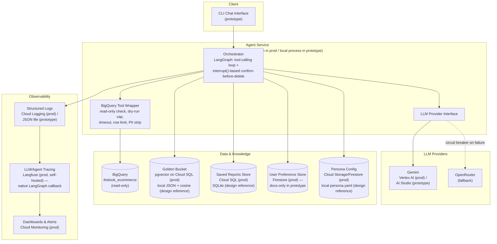

# Retail Data Analysis Agent — High-Level Design

Source of truth for architecture and design decisions. Update this file
whenever a decision changes. See `CLAUDE.md` for build constraints and
current prototype scope, `docs/assignment.md` for the brief, and
`docs/implementation-notes.md` for implementation-level detail, rejected
alternatives, and gaps found during testing — kept separate so this
document stays a fast read on a first pass.

## 1. Overview

An internal chat agent for non-technical Store/Regional Managers to ask
natural-language questions over `bigquery-public-data.thelook_ecommerce`,
discuss results conversationally, and save reports with action items. The
design below is a production HLD; the prototype implements a subset (see
§9) chosen to demonstrate the requirements that are actually gradeable as
working code, while every requirement is designed in full here regardless
of whether it's coded.

## 2. Architecture Diagram



## 2a. Current Graph Structure (generated, not hand-drawn)

The diagram above is the production system architecture — most of it
(Golden Bucket, Reports store, Persona config) isn't coded, and per §9
never will be in this prototype. This one is different in kind: it's
Mermaid syntax read directly off the real compiled `StateGraph` in
`graph.py` via `graph.get_graph().draw_mermaid()`, so it shows exactly
what's running today, not an aspiration. Regenerate it with
`uv run python scripts/render_graph.py` any time the graph changes.


- **`call_model`** — sends the running message history plus the tool
  schemas to the current LLM provider (Gemini, or OpenRouter if the
  circuit breaker has failed over) and appends whatever comes back (text,
  a tool call, or both).
- **`tools`** — executes every tool call in the latest model message
  against `BigQueryTool`, appends the results, and tracks per-turn
  self-correct/empty-result state (the resilience mechanisms in §5).
- **`give_up`** — terminal node reached when a tool error isn't
  self-correctable or the self-correct budget (2 retries) is exhausted;
  emits the error class's graceful user-facing message and ends the turn.
- **Solid edges** (`__start__ → call_model`, `give_up → __end__`) always
  fire. **Dashed edges** are conditional routing: out of `call_model` to
  `tools` only if the model's reply contains a function call, else
  `__end__`; out of `tools` back to `call_model` unless the self-correct
  budget is exhausted, in which case to `give_up` — the bounded
  self-correct loop described in §5. Backoff on transient BigQuery/provider
  errors happens beneath this graph entirely, inside `bq_tool.py`/the
  provider classes — a typed transient error reaching `tools`/`call_model`
  means backoff already ran out, so it's treated as non-self-correctable
  here.

## 3. Component Reasoning

**Orchestrator — LangGraph.** Two requirements map directly onto its
primitives: `interrupt()`/resume for the confirm-before-delete flow
(requirement 3, docs only), and checkpointing for conversation-state
persistence (requirement 4, docs only). Used for these mechanisms
specifically, not adopted decoratively — the architecture diagram maps
~1:1 onto actual graph nodes.

Also weighed against role-based multi-agent frameworks (CrewAI,
AutoGen) — unneeded coordination machinery for one agent with a
tool-calling loop, not a multi-agent crew — and provider-bundled agent
runtimes (OpenAI's Agents SDK, Vertex AI Agent Builder), ruled out
because they couple orchestration to one LLM vendor's SDK, conflicting
with the provider-agnostic `Provider` interface (below) the
Gemini/OpenRouter circuit breaker depends on.

**Extensibility — new tools and data sources.** New capabilities (chart
generation, emailing reports, web search) fall out of the tool-calling
shape already chosen rather than needing a separate mechanism: each is a
new function registered as a LangGraph tool alongside
`run_query`/`get_schema` (below), with the model deciding when to call
it, same as the coded tools today. A new data source follows the same
wrapper pattern as `BigQueryTool`: its own safety check appropriate to
that source, its own cost/row/timeout caps, and its own PII-stripping
pass before results reach the LLM, rather than a bespoke integration
path per source.

**Agent Service compute — Cloud Run.** Fits a synchronous,
intermittently-used chat workload better than GKE (cluster overhead
buying nothing a single container needs) or Cloud Functions (default
timeout too tight for a self-correct retry plus a BQ dry-run/execute):
scales to zero between conversations and takes an arbitrary container
image for the LangGraph process's actual dependencies.

**LLM provider — Gemini primary, OpenRouter fallback, behind a common
`Provider` interface.** Gemini via Vertex AI in production (shares
IAM/audit/quota plumbing with the BigQuery access already required); AI
Studio key in the prototype for simplicity. Default model is Gemini
Flash (`gemini-3.6-flash`, see §8), not Pro: both coded turn shapes
(schema-bound SQL generation, report synthesis over an already-small
PII-stripped result set) are closer to templated generation than
open-ended reasoning, so Flash's latency/cost fits a synchronous chat UX
better — Pro remains a viable production escalation for turns that fail
self-correct once, not implemented here to avoid a second model to
test/bill for at prototype scale. `OpenRouterProvider` (coded)
calls OpenRouter's OpenAI-compatible endpoint via the `openai` SDK —
OpenRouter's own documented integration path, chosen to avoid hand-rolled
request/response JSON translation the SDK already implements and tests;
its internal retry is disabled so the bounded-backoff wrapper (§5) is the
single source of retry behavior. `ProviderCircuitBreaker` (hand-rolled,
in-memory, single-process — no external dependency needed for a
synchronous CLI) opens after `PROVIDER_FAILURE_THRESHOLD` (default 2)
consecutive Gemini failures, routes to OpenRouter for
`PROVIDER_COOLDOWN_SECONDS` (default 60), then retries Gemini — the
concrete mechanism for "resilient to 3rd-party downtime" (requirement 5).
Only constructed when `OPENROUTER_API_KEY` is set; with no fallback
configured, Gemini failures surface directly as a graceful error message.

Both providers talk to their SDK directly rather than through LangChain's
chat model wrappers — see
[implementation-notes.md](implementation-notes.md#llm-provider-raw-sdks-vs-langchain-chat-model-wrappers)
for the full reasoning. Short version: exception classification is a wash
either way (LangChain doesn't unify exceptions, so a classifier of the same
shape is still needed under it), so that's not the real reason. The real
reasons are a self-pinned exception surface and direct control over exact
request shape (e.g. disabling the SDK's automatic function-calling so
the graph drives the loop). What LangChain would remove is the
hand-rolled message/tool-schema translation `openrouter_provider.py`
needs today; small at two providers (Gemini itself needs none) but
doesn't stay small — worth
revisiting if a third LLM provider is added, or if Hybrid Intelligence's
Golden Bucket pulls in LangChain's retriever integrations anyway.

**BigQuery tool wrapper.** `src/provided/bq_runner.py` was supplied by the
company as an example of how to query BigQuery, not a required
dependency — it's left in the repo unused. A raw `bigquery.Client` call
(what it thinly wraps) has no cost cap, no statement-type check, no PII
masking, and collapses every failure into one exception shape. It backs
two tools exposed to the model: `get_schema` (table/column
introspection — how "what data is available" questions get answered)
and `run_query`. The wrapper (`BigQueryTool`, which owns its own client)
adds: a SQL read-only
keyword/regex allowlist (SELECT/WITH only, reject DML/DDL and
multi-statement input) with the service account's IAM read-only role as
the real backstop; `dry_run=True` plus a ~1GB max-bytes cap (well under
the 1TB/month free tier); a query timeout; a row limit; PII column
stripping applied post-execution by matching each returned column's bare
name against a maintained PII field registry; and typed error
classification (syntax, permission, transient, empty-result) so the
orchestrator can decide retry vs. self-correct vs. give-up instead of
re-parsing a bare exception.

The PII match is name-based, not a true schema-driven allow-list — it can
miss a column renamed in the query, or one added to the live schema after
the registry was written. See
[implementation-notes.md](implementation-notes.md#bigquery-pii-stripping-name-based-matching-not-a-true-allow-list)
for why that trade-off was accepted (a true allow-list would also drop
legitimate aggregate columns like `SUM(sale_price) AS total_revenue`) and
what covers the gap. The registry was verified against the live `users`
schema during development, not just typed from the brief — that check
caught two columns (`postal_code`, `user_geom`) absent from the
assignment's original PII list before they could leak.

**Golden Bucket (docs only).** Question embedded at query time
(`text-embedding-004`), top-k (e.g. k=3) cosine/ANN retrieval against
**pgvector on Cloud SQL** — retrieved (question, sql, report) trios are
injected as few-shot context before SQL generation and again as
style/structure cues before report writing. pgvector over Vertex AI
Vector Search because the human-curated update path (below) keeps the
corpus in the thousands of vectors, not millions — comfortably inside
pgvector's range, and it co-locates with the Saved Reports Store's Cloud
SQL instance instead of paying for a second managed vector service;
Vertex AI Vector Search would be worth revisiting if the bucket is ever
seeded from a large historical archive instead of growing incrementally.

Update path is human-curated, not automatic: a trio is appended only
after a human analyst approves or edits the generated report,
specifically to avoid feedback-loop drift where an unreviewed mistake
compounds into future retrievals. Periodic
maintenance: dedup near-identical trios, down-weight/archive trios past a
freshness horizon (e.g. 12 months), and version trios rather than
overwrite them in place.

**Saved Reports Store (docs only).** Cloud SQL/Postgres, schema: `id,
owner, title, content, conversation_id, created_at, tags` — gives real
queryable delete-scoping (`WHERE owner = ? AND content LIKE ?`), which is
what the confirm-then-delete flow in requirement 3 actually needs rather
than asserts in prose. Not built in the prototype (§9); "create a report
with action items" — the base deliverable-3 ask, distinct from
requirement 3 — is satisfied by the agent formatting its chat answer as a
report, with no persistence layer required.

Cloud SQL vs. Firestore below follows one rule: relational/queryable
access (arbitrary `WHERE` clauses, joins) goes in Cloud SQL; single-key
document reads/writes go in Firestore. Reports and the Golden Bucket need
the former; preferences and persona don't.

**User Preference Store (docs only).** Firestore doc per manager
(preferred format, analysis depth, updated_at), read into the system
prompt each turn, written after an explicit ("just give me the numbers")
or recurring implicit preference signal — Firestore, not Cloud SQL,
since every access is a single lookup by manager id.

**Persona Config (docs only).** A single versioned instruction document
external to code — a Firestore row or Cloud Storage file (whichever fits
the eventual admin surface — a CRUD form or a re-uploaded file), editable
with no engineering ticket, read fresh each session. This is the concrete
mechanism for "CEO changes tone weekly, no redeploy" (requirement 8).

**Observability (docs only as a coded requirement — see §9).** Target
shape: one structured JSON log line per LLM call / tool call / turn
(conversation_id, intent, sql, rows_returned, tokens, latency_ms,
error_class, self_correct_attempt). The prototype has only incidental
`logging` calls with `extra=` fields at error/retry sites, added as a
by-product of building resilience depth (§5), not a deliberate
implementation of this requirement — there's no per-turn structured JSON
line and no log covers the successful path. Production ships the full
log shape to Cloud Logging (metrics/alerting substrate) *and* adds
cross-call conversation tracing via self-hosted **Langfuse**, chosen
because it plugs into LangGraph as a native callback handler — no
hand-rolled OpenTelemetry spans needed. Self-hosted over LangSmith:
tracing must cover the same PII boundary the rest of this system respects,
and self-hosting keeps trace data in the same infra boundary rather than
handing prompts/SQL/tool output to a third-party SaaS by default —
whatever tracer is used, it must trace **post-PII-strip** data only.
Cloud Monitoring dashboards/alerts sit on top of the Cloud Logging stream
for error rate, self-correct rate, latency, PII-block rate, and daily
cost; Langfuse covers the conversation-level "what exactly happened in
this exchange" deep-dive that raw metrics can't.

## 4. Data Flow

Described here at production scope; the prototype implements only the
coded steps of the Q&A path below (§9) — Golden Bucket retrieval, persona
config, user preferences, and the entire Delete path are docs only.

**Q&A / analysis path**: user message → lightweight guardrail check
(analysis vs. off-topic/malicious vs. delete-intent) → embed question,
retrieve top-k Golden Bucket trios → LLM generates SQL using trios +
schema as context → BQ wrapper validates (read-only check) → dry-run
(reject over cap) → execute with timeout + row limit → PII-strip the
DataFrame → LLM synthesizes the report/answer using persona config + user
preferences → response returned to the client and logged.

**Delete path**: user message → LLM resolves the request into candidate
report(s) via a store query scoped to the requesting user (never
cross-user) → orchestrator lists the exact candidates and pauses via
`interrupt()` → next user turn: "yes" resumes the graph and executes the
delete against the store; anything else aborts. Both outcomes are logged.
Non-mutating actions (e.g. "show me my reports") never trigger this
pause — only the delete itself does, keeping the added friction to one
turn. This entire path depends on the Saved Reports Store (§3).

## 5. Error Handling & Fallback Strategies

Coded (`errors.py`, `bq_tool.py`, `graph.py`, `llm_provider.py`,
`openrouter_provider.py`, `circuit_breaker.py`, `resilience.py`). Every
`AgentError` subclass carries a `self_correctable: bool` flag and a
`graceful_message` — the graph routes on the flag, never ad hoc
isinstance checks, and `errors.graceful_message_for(...)` is the single
place user-facing copy for a failure class lives.

Two independent retry mechanisms: **backoff** (inside
`bq_tool.py`/the providers) retries the *same* call automatically when
the client's raw exception looks transient. **Self-correct** (in
`graph.py`, gated by `self_correctable`) lets the *model* retry with a
*different* query, only after a typed error reaches the graph. See
[implementation-notes.md](implementation-notes.md#two-retry-mechanisms-backoff-vs-self-correct)
for why these are deliberately separate mechanisms rather than a
contradiction.

| Error class | Mechanism | Outcome |
|---|---|---|
| Syntax/bad-request (`QuerySyntaxError`, `SQLSafetyError`, `QueryTooExpensiveError`) | Self-correct | Fed back to the model as the tool result; up to 2 retries (`MAX_SELF_CORRECT_ATTEMPTS`), 3rd attempt routes to `give_up` with a graceful message — never an unbounded loop |
| Permission (`QueryPermissionError`) | None | Straight to `give_up` on first occurrence — no query rewrite fixes an IAM grant |
| Empty result (0 rows) | One sanity-check pass | Model is nudged once per turn to check its own filters/joins before accepting "zero rows"; a second zero-row result in the same turn is accepted rather than looping |
| Transient/timeout — BQ or provider (`QueryTransientError`/`ProviderTransientError`) | Backoff (2 attempts, exponential, `tenacity`-based, shared across all 3 retry sites) | If backoff exhausts, the typed error reaches the graph already non-self-correctable → `give_up` (BQ), or propagates to `cli.py`'s top-level `except AgentError` handler (provider), which prints the graceful message and keeps the REPL loop alive |
| LLM provider failure | Circuit breaker (§3) | Opens after `PROVIDER_FAILURE_THRESHOLD` consecutive Gemini failures, routes to OpenRouter for `PROVIDER_COOLDOWN_SECONDS`, then retries Gemini |

Self-correct operates on the whole model turn, not per tool call — if a
turn fires multiple tool calls and one fails non-self-correctably while
another succeeds, the entire turn gives up rather than keeping the
successful result. Deliberate, not an oversight (each `call_model`
regenerates the whole call set fresh, so there's no partial-retry path) —
see
[implementation-notes.md](implementation-notes.md#known-gaps-found-during-testing)
for the full reasoning and test coverage.

Every failure path is logged (Python stdlib `logging`, `extra=` fields —
see the Observability note in §3) with its error class
(`bq_call_failed`/`bq_unclassified_exception`, `tool_call_error`,
`provider_call_failed`, `provider_failover`, etc.). No path crashes the
CLI loop; every path terminates in either a valid answer or a bounded,
legible error message. Three gaps found during live testing are recorded in
[implementation-notes.md](implementation-notes.md#known-gaps-found-during-testing):
an empty-result check that doesn't fire for `COUNT(*)` queries; an
invalid-API-key error classified as a generic `ProviderError` instead of
`ProviderAuthError`; and the resulting auth/transient distinction not
actually being used anywhere — `call_model` lets a `ProviderError`
propagate past the graph's curated-message pipeline entirely, and the
circuit breaker treats an unrecoverable bad key the same as a recoverable
rate limit, cycling open forever instead of surfacing a distinct message.
None has a functional or safety impact (the CLI loop never dies and
OpenRouter still answers), but the last one silently masks a config problem
behind the fallback provider rather than surfacing it.

## 6. Requirement-by-Requirement Handling

**1. Hybrid Intelligence — docs only.** See Golden Bucket in §3. Key
design choice: a human-in-the-loop update gate — the bucket only grows
from analyst-approved reports, trading update speed for protection
against the agent reinforcing its own errors.

**2. Safety & PII Masking — coded.** Two independent layers: an
input-side guardrail rejects off-topic/malicious requests before any
tool call happens, and an output-side hard control — name-based PII
column stripping in the BQ wrapper (§3) — guarantees known-PII columns
never leave the wrapper even if the guardrail is bypassed. Defense in
depth: the read-only SQL check and the service account's IAM read-only
role are independent backstops against a malicious or buggy query in the
first place.

**3. High-Stakes Oversight — docs only** (eligible for the prototype,
deliberately not coded — see §9). See delete path in §4. The
resolve-then-list-then-confirm shape is the intended safeguard; the
confirmation mechanism itself (a plain yes/no next turn) is deliberately
boring so it wouldn't become UX friction for a routine action users are
allowed to take on their own reports.

**4. Continuous Improvement — docs only.** User-level: preference
profile (§3), injected into the system prompt. System-level: explicitly
*not* automatic fine-tuning — high risk for a decision-support tool.
Instead, positively-signaled interactions (saved/approved reports) become
Golden Bucket candidates (requirement 1), and a periodic (e.g. weekly)
human review of low-signal interactions (self-correct exhausted, user
abandoned, explicit negative feedback) feeds a prompt/instruction
changelog reviewed by an engineer.

**5. Resilience & Graceful Error Handling — coded.** See §5.

**6. Quality Assurance — docs only** (eligible for the prototype,
deliberately not coded — see §9). Offline golden eval set — representative
questions with expected SQL shape and report themes, curated by a human
analyst — scored by an LLM-as-judge rubric (right numbers, answers the
actual question, no PII), periodically cross-checked against human
grading, re-run as a regression gate before any prompt/persona/bucket
change ships. UX would be evaluated from the same structured logs
Observability would capture, rather than a separate survey mechanism.

**7. Observability — docs only** (eligible for the prototype,
deliberately not coded — see §9; only the incidental `logging` calls from
resilience work exist today). See §3. In production, every log line
would carry `conversation_id`, so a full exchange could be reconstructed
by filtering the JSON log; a Langfuse trace view gives the same
reconstruction without a log grep.

**8. Agility / Persona Management — docs only.** See Persona Config in
§3. A CEO-requested tone change ships by editing an external document,
not by a code deploy.

## 7. Quality Assurance / Evaluation

See requirement 6 above for the full approach. In short: a curated golden
set + LLM-as-judge scoring (spot-checked by humans) as a pre-ship
regression gate, and UX measured passively from production observability
data rather than a separate instrumentation surface. No eval script,
golden set, or judge rubric exists in this repo — this section describes
the intended production approach only.

## 8. Setup Instructions & Example Run

Two independent things need to be configured, and they have different
prerequisites — Gemini is a single API key with nothing else to install;
BigQuery needs the `gcloud` CLI and a real GCP project, even though the
dataset being queried (`thelook_ecommerce`) is public.

**1. Python environment**

- Python 3.11
- [`uv`](https://docs.astral.sh/uv/getting-started/installation/) installed

**2. Gemini (LLM provider)**

- Get a free API key from [Google AI Studio](https://aistudio.google.com/apikey)
- No other setup — this is just `GEMINI_API_KEY` in `.env`

**3. BigQuery (data source)**

- Install the [`gcloud` CLI](https://cloud.google.com/sdk/docs/install) if
  you don't already have it
- Have (or create) a GCP project with the BigQuery API enabled and billing
  active — required even though `thelook_ecommerce` is a public dataset,
  because dry-run cost estimation and query execution both run as *your*
  project, not the dataset owner's
- Run `gcloud auth application-default login` once (opens a browser) to
  create local Application Default Credentials
- Set `GOOGLE_CLOUD_PROJECT` in `.env` to that project's ID

```bash
gcloud auth application-default login
cp .env.example .env   # fill in GOOGLE_CLOUD_PROJECT and GEMINI_API_KEY
# or export them directly — .env is picked up automatically (python-dotenv),
# but real environment variables always take precedence over it.

uv sync
uv run retail-agent
```

**Troubleshooting:** a `PermissionDenied`/403 on startup or on the first
query almost always means one of the BigQuery-specific steps above was
skipped — either the BigQuery API isn't enabled on the project named by
`GOOGLE_CLOUD_PROJECT`, billing isn't active on it, or
`gcloud auth application-default login` was never run (or was run for a
different account/project than the one in `.env`). Gemini-side failures
(invalid/missing `GEMINI_API_KEY`) surface as a graceful provider error
message rather than a crash — see §5.

Optional env vars (defaults shown): `GEMINI_MODEL=gemini-3.6-flash`,
`BQ_MAX_BYTES_BILLED=1000000000` (~1GB), `BQ_ROW_LIMIT=500`,
`BQ_QUERY_TIMEOUT_SECONDS=30`, `LOG_LEVEL=INFO`.

Provider fallback / circuit breaker (resilience-depth slice — coded):
`OPENROUTER_API_KEY` (unset by default — the CLI runs Gemini-only with no
circuit breaker when it's absent, since there's nowhere to fail over to),
`OPENROUTER_MODEL=openai/gpt-4o-mini`, `PROVIDER_FAILURE_THRESHOLD=2`
(consecutive Gemini failures before the breaker opens),
`PROVIDER_COOLDOWN_SECONDS=60` (how long OpenRouter is used before Gemini
is tried again).

Run the test suite: `uv run pytest`. This runs only the unit tests by
default. `tests/integration/` — live regression checks against real
BigQuery/Gemini (PII stripping holds even when explicitly selected, and
one end-to-end smoke question) — deliberately requires
`GOOGLE_CLOUD_PROJECT`/`GEMINI_API_KEY` as real *exported* environment
variables, not just values in `.env`, so `uv run pytest` never silently
runs live, billed calls just because `.env` happens to be configured for
the CLI. To run them explicitly:
`set -a && source .env && set +a && uv run pytest tests/integration`.

Example session:

```
> Why did our churn rate spike last month?
[agent generates SQL, queries BigQuery read-only, strips PII, returns an
 analysis]

> Turn that into a report with action items for next quarter
[agent formats the analysis as a report — summary, key findings, action
 items — returned in the chat; not persisted, since the Saved Reports
 store (§3) isn't built in the prototype]
```

Golden Bucket retrieval and the delete-confirmation flow shown in earlier
drafts of this example aren't in the prototype — see §9.

## 9. Prototype vs. Production Scope Matrix

| Requirement | Prototype (coded) | Production (design only) |
|---|---|---|
| 1. Hybrid Intelligence | Docs only | Vertex AI Vector Search, human-curated updates |
| 2. Safety & PII Masking | **Coded** — guardrail + name-based PII stripping (schema-verified) | Same, at scale |
| 3. High-Stakes Oversight | Docs only — eligible for the prototype, deliberately not coded | Cloud SQL reports store + interrupt-based confirm |
| 4. Continuous Improvement | Docs only | Firestore preference store; human-gated system learning |
| 5. Resilience & Error Handling | **Coded** — typed errors, self-correct, backoff, circuit breaker | Same, at scale |
| 6. Quality Assurance | Docs only — eligible for the prototype, deliberately not coded | Golden eval set + scoring script, judge-drift audits |
| 7. Observability | Docs only — eligible for the prototype, deliberately not coded | Structured JSON logs → Cloud Logging + Monitoring dashboards/alerts + Langfuse (self-hosted) for conversation-level tracing |
| 8. Agility (Persona) | Docs only | Firestore/Cloud Storage config, admin surface |

Exactly 2 of 8 requirements are coded (both eligible for the prototype per
the assignment's deliverable-3 list, which allows any 2 of 5). The other 3
eligible requirements (High-Stakes Oversight, Quality Assurance,
Observability) are a deliberate scope decision, not a time cutoff — the
build order (see `CLAUDE.md`) stops after resilience depth by design. The
remaining 3 requirements (Hybrid Intelligence, Continuous Improvement,
Agility) were never in the assignment's prototype-eligible list, so
they're designed here in full but were never candidates for coding
either way.
